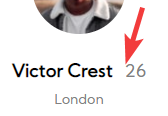

# Profile card component solution

This is a solution to the [Profile card component challenge on Frontend Mentor](https://www.frontendmentor.io/challenges/profile-card-component-cfArpWshJ). Frontend Mentor challenges help you improve your coding skills by building realistic projects. 

## Table of contents

- [Overview](#overview)
  - [The challenge](#the-challenge)
  - [Screenshot](#screenshot)
  - [Links](#links)
- [My process](#my-process)
  - [Built with](#built-with)
  - [What I learned](#what-i-learned)
  - [Continued development](#continued-development)
  - [Useful resources](#useful-resources)
- [Author](#author)
- [Acknowledgments](#acknowledgments)

**Note: Delete this note and update the table of contents based on what sections you keep.**

## Overview

### The challenge

- Build out the project to the designs provided

### Screenshot


### Links

- Solution URL: [Add solution URL here](https://your-solution-url.com)
- Live Site URL: [Add live site URL here](https://your-live-site-url.com)

## My process

### Built with

- Semantic HTML5 markup
- CSS custom properties
- Flex-box
- CSS Grid
- Mobile-first workflow

### What I learned

There are things that I could solve on the road and that they were necessary to replicate the challenge as the same as possible:

I had problems to fully stretch the background of the user image, for no method from CSS I could, so I knew and change the width of the SVG from the file itself, which can be done directly from CSS if the correct properties are used:
```html
<svg width="978" height="978" xmlns="http://www.w3.org/2000/svg">...
```

In the HTML you can use a special "invisible" character in order to add more separation space to a word specifically, instead of using the CSS letter-spacing as in the example of the image:
```html
	  ↓
<span>⠀26</span>
```
 

In CSS for properties with several blocks of values ​​that are separated by comma, you can place one below one for better readability:
```css
body{
    ...
    background: url(images/bg-pattern-top.svg) -740px -640px no-repeat,
                url(images/bg-pattern-bottom.svg) 118px 270px no-repeat,
                #19A1AD;
}
```

Using the CSS BEM methodology, we have to be careful with the name of the classes, it will make elements that interfere with class names do not show correctly:

```Css
.child-container {
    ... some rules ...
}
/*=========================*/
.social-container { 🚫❌❌❌
    🚫The Container class is repeated, an
    unnoticed error, and is not showed correctly.
}

.social {✅
    ✅ Better solution
}

```

### Continued development

Specifically, my future goal for the kind of skills in this challenge, is to be able to use Flexbox and Css Grid in larger and more complex page layouts, and to be faster at debugging CSS in general, **just because it's not a programming language, doesn't mean it's not complex.**

### Useful resources

- [W3Schools](https://www.w3schools.com/) - Excellent tool for fast CSS queries in case of doubts.
- [Css Tricks](https://css-tricks.com/) - This specific site I like to support me in the complete articles of [Flex-Box](https://css-tricks.com/snippets/css/a-guide-to-flexbox/) and [Grid](https://css-tricks.com/snippets/css/complete-guide-grid/#prop-grid).
- [ShareX](https://getsharex.com/) - Great software that I use in my day by day, in this case, use the rule, the color picker and the magnifying glass.

## Author

- Website - [Add your name here](https://www.your-site.com)
- Frontend Mentor - [@yourusername](https://www.frontendmentor.io/profile/yourusername)
- Twitter - [@yourusername](https://www.twitter.com/yourusername)

**Note: Delete this note and add/remove/edit lines above based on what links you'd like to share.**

## Acknowledgments

This is where you can give a hat tip to anyone who helped you out on this project. Perhaps you worked in a team or got some inspiration from someone else's solution. This is the perfect place to give them some credit.

**Note: Delete this note and edit this section's content as necessary. If you completed this challenge by yourself, feel free to delete this section entirely.**
